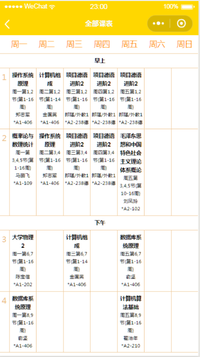
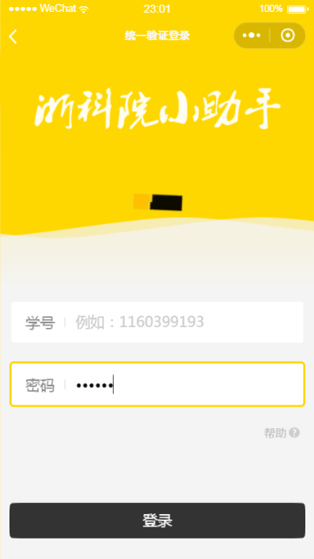
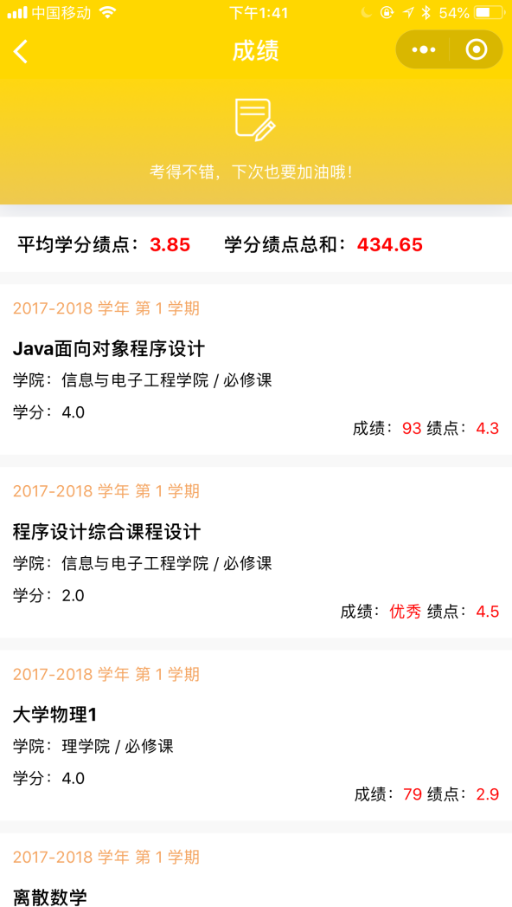
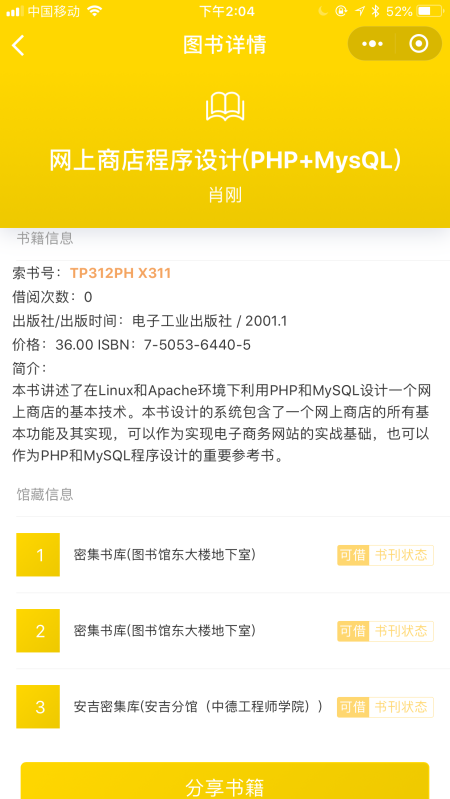
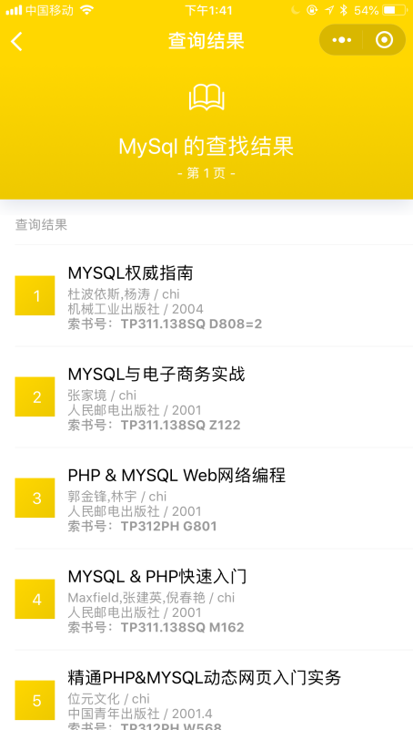
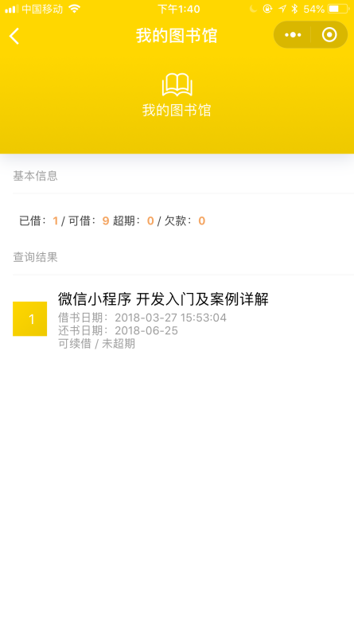
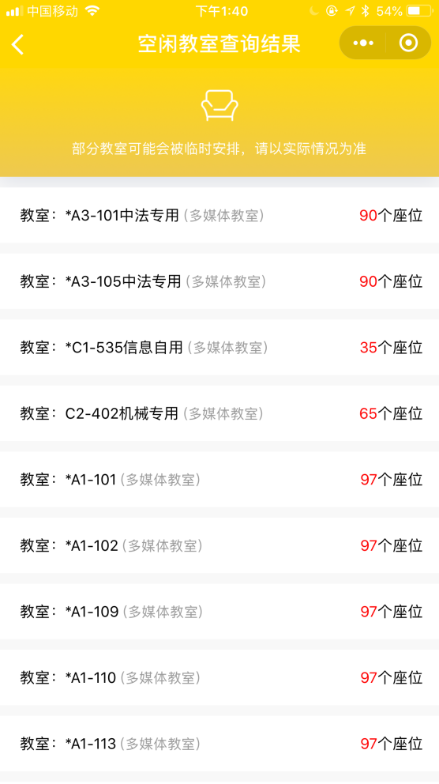

# ZustHelper-WxApp
[Java后端](https://github.com/netbeifeng/zustHelper_Java_Server)基于HttpClient爬虫，以及 PhantomJS 实现。 

前端大部分fork自[文经课表](https://github.com/st1ven/WeApp-timeTable)，少部分页面（如电费充值，一卡通，图书馆等针对ZUST做了适配）

本项目为文经课表的同时空异构体。

介绍文档(德语) -> [Introduction](./Introduction_de.pdf)

# 主界面

# 课表界面

# 登录界面

# 一卡通界面

# 电费登录界面

# 更多

# 成绩查询

# 校历

# 图书馆

# 空教室

